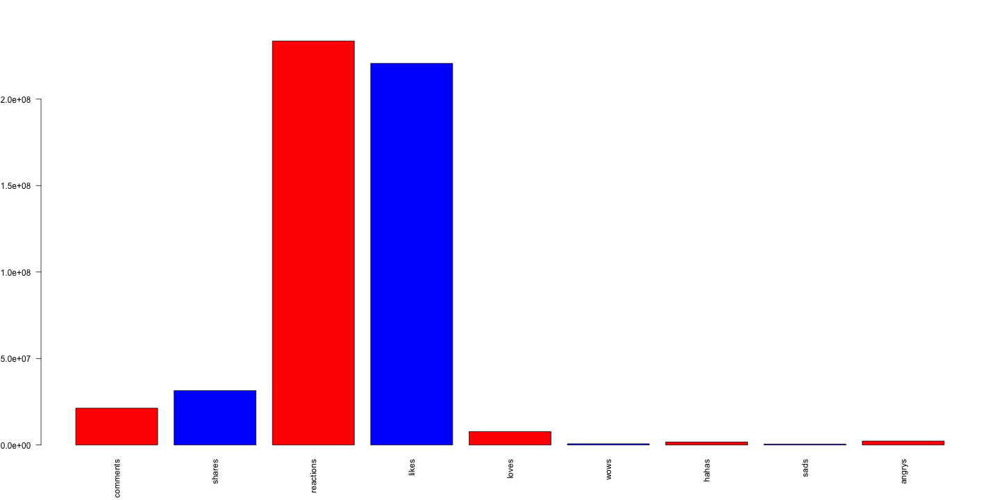
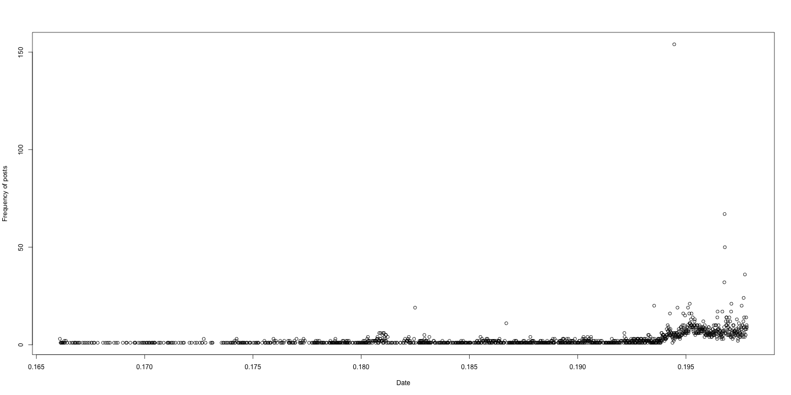
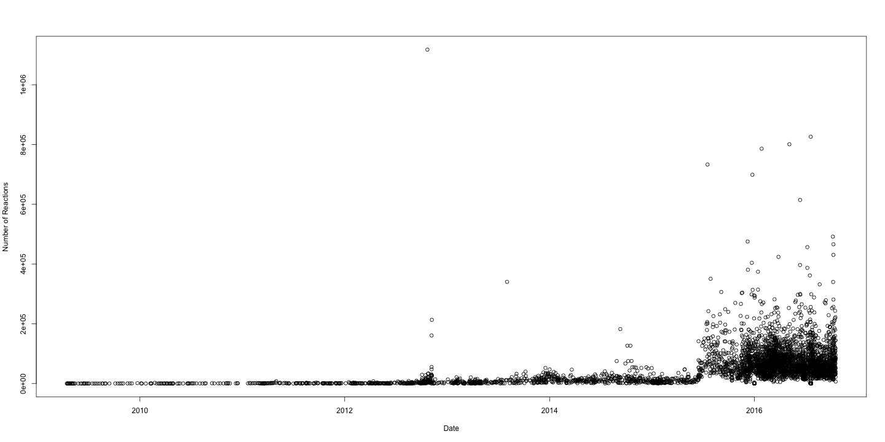
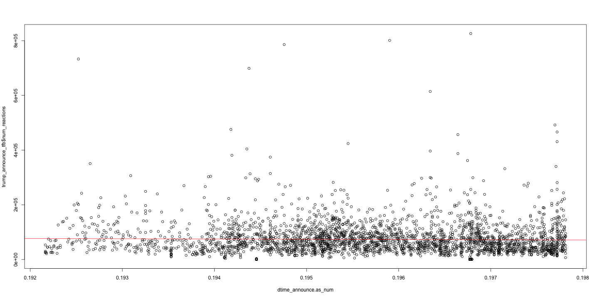
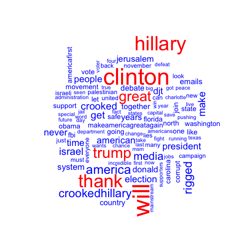
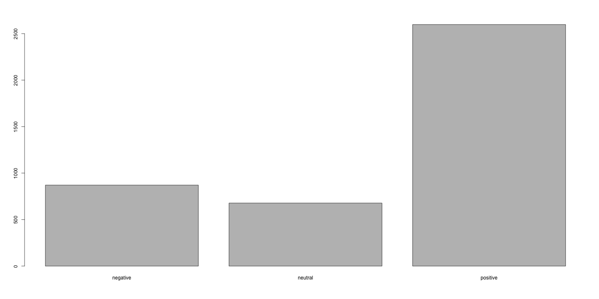

Donald Trump on Facebook
========================================================
author: James Dayhuff
date: 12/8/2016
autosize: true
css: my_style.css

Purpose
========================================================

To objectively analyze Donald Trump's behavior on Facebook and other's reactions to him.

(Facebook posts from 2009 - 2016)

Questions to be answered:

- How did Trump's Facebook behavior change after he announced his presidential candidacy?
- How did the responses to his Facebook behavior change over time?
- What were his most popular topics of interest?

Note: This analysis is purely descriptive analytics, not predictive.

The Data
========================================================

Number of observations: 4162

| Variable Name | Data Type |
|------:|:-----|
| Status_id  |  Useless  |
| Status_message  |  Character |
| Link_name  |    Character |
| Status_type  |    Character |
| Status_Published  |    Date |
| Num_reactions  |    Int |
| Num_comments  |    Int |
| Num_shares  |    Int |
| Num_likes  |    Int |
| Num_loves  |    Int |
| Num_wows  |    Int |
| Num_hahas  |    Int |
| Num_sads  |    Int |
| Num_angrys  |    Int |


EDA - Numeric variables compared
========================================================



Num_Reactions turns out to be the cumulative of all variables except comments and shares.

The lowest values (loves, wows, hahas, sads, angrys) occur because those reactions were only recently available in Feburary 2016. We need to subset the data once we begin our actual investigation.


EDA - Summary of numeric variables
========================================================

| Variable Name | Min | Median | Mean | Max | Skewness |
|------:|:-----:|:-----|:-----|:-----|:-----|
| num_comments  |  3  | 3,456 | 5,111  | 319,700 | Right Skew |
| num_shares  |  0 | 3,146 | 7,560  | 812,800  | Right Skew |
| num_reactions  | 7 | 42,600 | 56,160  | 1,118,000  | Right Skew |
| num_likes  | 7 | 39,960  | 53,050  | 1,118,000  | Right Skew |

Dealing with massive ranges.

There is a right skew to every variable.

(This is excluding the newest Facebook reactions because they were released during his election campaign.)


Back to original questions
========================================================
How did Trump's Facebook behavior change after he announced his presidential candidacy?

How did the responses to his Facebook behavior change over time?

What were his most popular topics of interest?
  

How did Trump's Facebook behavior change after his announcement?
========================================================



Highly significant relationship, P-value of <2e-16

Compare before announcement to after announcement:
  - Percent Increase of 1139% (from posting rate of .498/day to 6.17/day)


How did the responses to his Facebook behavior change over time?
========================================================



Highly significant relationship, P-value of <2e-16

Compare before announcement to post announcement:
  - Percent Increase of 1895% (from ~11 mil total reactions to ~222 mil total reactions)


How did the responses change over the course of his campaign?
========================================================




Time of post loses signifance once campaign began

P-value of 0.26


Fun Fact 1
========================================================

Most Likes: 1,117,712 

```
[1] "Stop congratulating Obama for killing Bin Laden  The Navy Seals killed Bin Laden "
```


Fun Fact 2
========================================================

Most Angrys: 84,015

```
[1] "Happy Cinco de Mayo  The best taco bowls are made in Trump Tower Grill I love Hispanics "
```

Fun Fact 3
========================================================

Most Comments: 319,745

```
[1] "Join Donald J Trump for his Millennial Event in Columbus  Ohio"
```

```
[1] "video"
```

```
[1] "2016-10-13"
```


What were his most popular topics of interest?
========================================================
For the most recent 100 Facebook posts...




Bonus Question: What sentiment did he express most?
========================================================




Conclusion
========================================================

How did Trump's Facebook behavior change after he announced his presidential candidacy?
  - Percent Increase of 1139%

How did the responses to his Facebook behavior change over time?
  - Percent Increase of 1895%

What were his most popular topics of interest?
  - Hillary Clinton
  - Make America Great Again
  
  
Future Analysis
========================================================

Predict number of reactions based on a text analysis of word choice.

Cluster his Facebook posts based on text analysis of word choice or on number of reactions.


========================================================
Thank you

